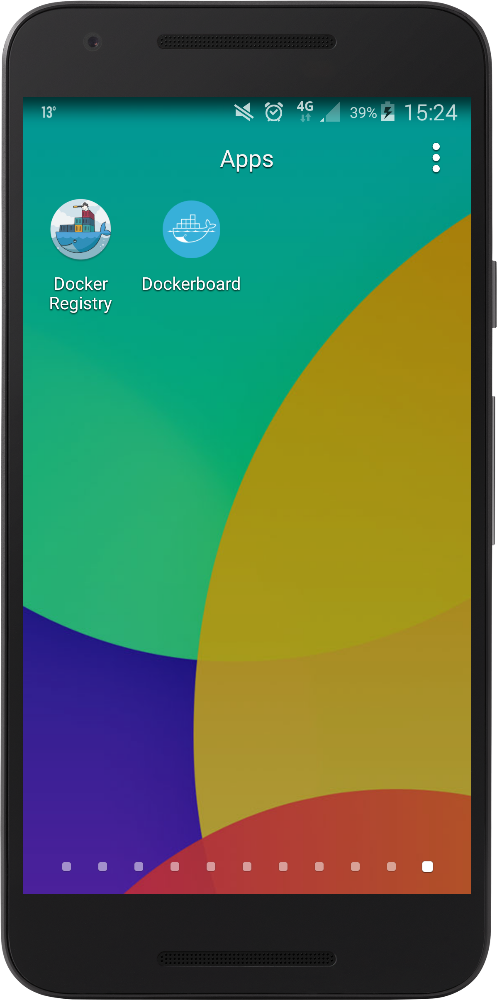
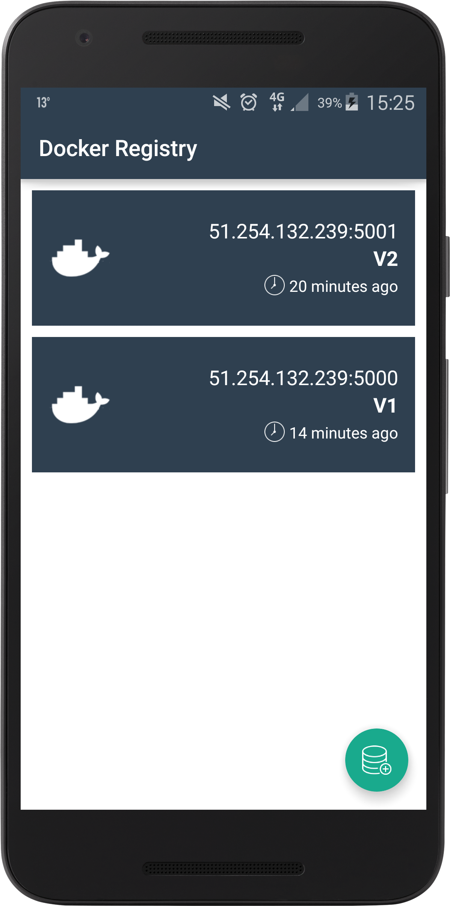
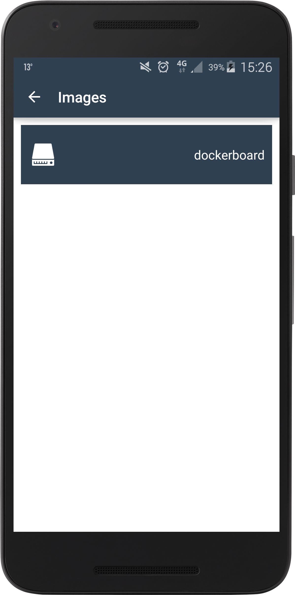
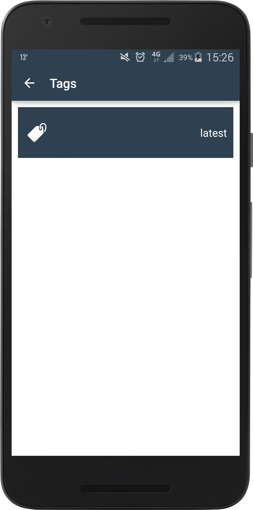
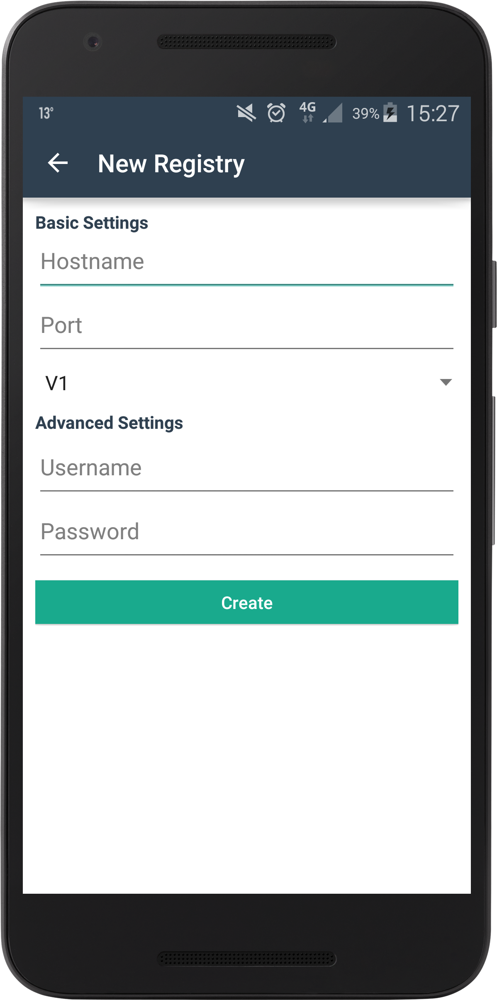

# docker-registry-android

Manage docker registry directly in your android phone

# Screenshots

  
  
  
  
  

# Download

Version | Link
--------------
1.0 | <a href="build/docker-registry.apk">Download</a>

# Developer

Mohamed Labouardy <mohamed@labouardy.com>

# Stack

- Android SDK
- OKHttp
